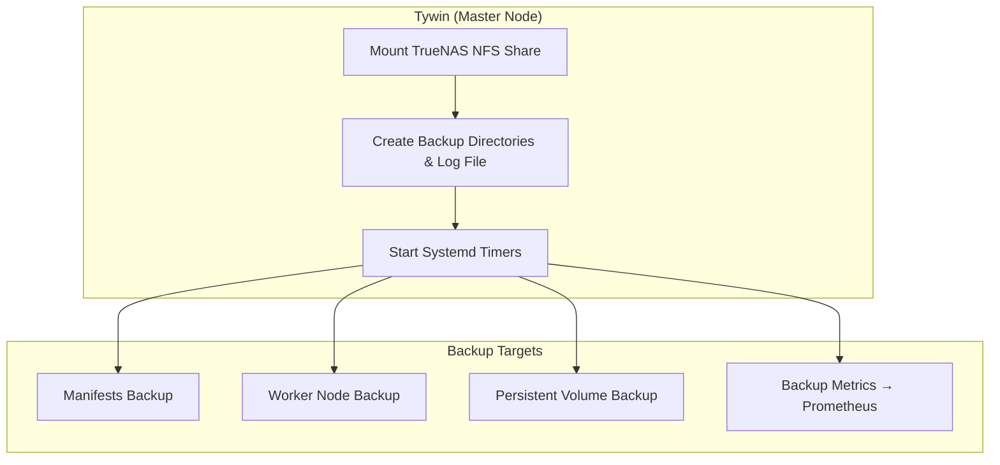

## 8️⃣ Ansible Playbook: Automating K3s Backups 🛠️

This section explains the **Ansible playbook** used to automate K3s backups to a TrueNAS NFS share. Using Ansible ensures that **all steps are reproducible, consistent, and maintainable**, without relying on manual commands on each node.

---

### Why Use an Ansible Playbook?

- **Consistency:** Ensures the same backup setup across all K3s nodes.  
- **Automation:** Cron jobs, directory creation, and NFS mounting happen automatically.  
- **Idempotency:** Running the playbook multiple times does not break existing setup.  
- **Centralized control:** Only Tywin (the master node) handles NFS mounting and backup orchestration, avoiding conflicts.  
- **Auditability:** All tasks are documented in YAML, easy to review or version in GitHub.

---

### Overview of the Playbook

```yaml

---
- name: Setup K3s Backups and Metrics on Tywin
  hosts: tywin
  become: yes
  vars:
    truenas_nfs: "10.0.10.80:/mnt/tera/backups/k3s"
    mount_point: "/mnt/backup-tera"

    k3s_manifests_dir: "{{ mount_point }}/manifests"
    k3s_nodes_dir: "{{ mount_point }}/nodes"
    k3s_pv_backup: "{{ mount_point }}/pv"
    log_file: "/var/log/k3s-backups.log"

    systemd_services:
      - name: "k3s-manual-backup"
        desc: "Run K3s backup to TrueNAS"
        script: "/usr/local/bin/k3s_manual_backup.sh"
        timer_on_boot: true
        interval_min: 1440    # Daily (24h)
      - name: "k3s-backup-metrics"
        desc: "Update K3s backup metrics for Prometheus"
        script: "/usr/local/bin/k3s_backup_metrics.sh"
        timer_on_boot: true
        interval_min: 5       # Every 5 minutes

  tasks:

    - name: Mount TrueNAS NFS share
      mount:
        path: "{{ mount_point }}"
        src: "{{ truenas_nfs }}"
        fstype: nfs
        opts: defaults,_netdev,nfsvers=4
        state: mounted

    - name: Ensure backup directories exist
      file:
        path: "{{ item }}"
        state: directory
        mode: '0755'
      loop:
        - "{{ k3s_manifests_dir }}"
        - "{{ k3s_nodes_dir }}/jaime"
        - "{{ k3s_nodes_dir }}/tyrion"
        - "{{ k3s_pv_backup }}"

    - name: Ensure log file exists
      file:
        path: "{{ log_file }}"
        state: touch
        mode: '0644'

    - name: Setup systemd service and timer units
      block:
        - name: Create systemd service file
          copy:
            dest: "/etc/systemd/system/{{ item.name }}.service"
            content: |
              [Unit]
              Description={{ item.desc }}
              After=network.target

              [Service]
              Type=oneshot
              ExecStart={{ item.script }}
              StandardOutput=append:{{ log_file }}
              StandardError=append:{{ log_file }}

              [Install]
              WantedBy=multi-user.target
          loop: "{{ systemd_services }}"

        - name: Create systemd timer file
          copy:
            dest: "/etc/systemd/system/{{ item.name }}.timer"
            content: |
              [Unit]
              Description=Timer for {{ item.desc }}

              [Timer]
              OnBootSec=1min
              OnUnitActiveSec={{ item.interval_min }}min
              Persistent=true

              [Install]
              WantedBy=timers.target
          loop: "{{ systemd_services }}"

        - name: Enable and start timers
          systemd:
            name="{{ item.name }}.timer"
            enabled: yes
            state: started
          loop: "{{ systemd_services }}"
```

## 9️⃣ Ansible Playbook Flow Diagram 🌐

This diagram visualizes how the Ansible playbook automates K3s backups:


