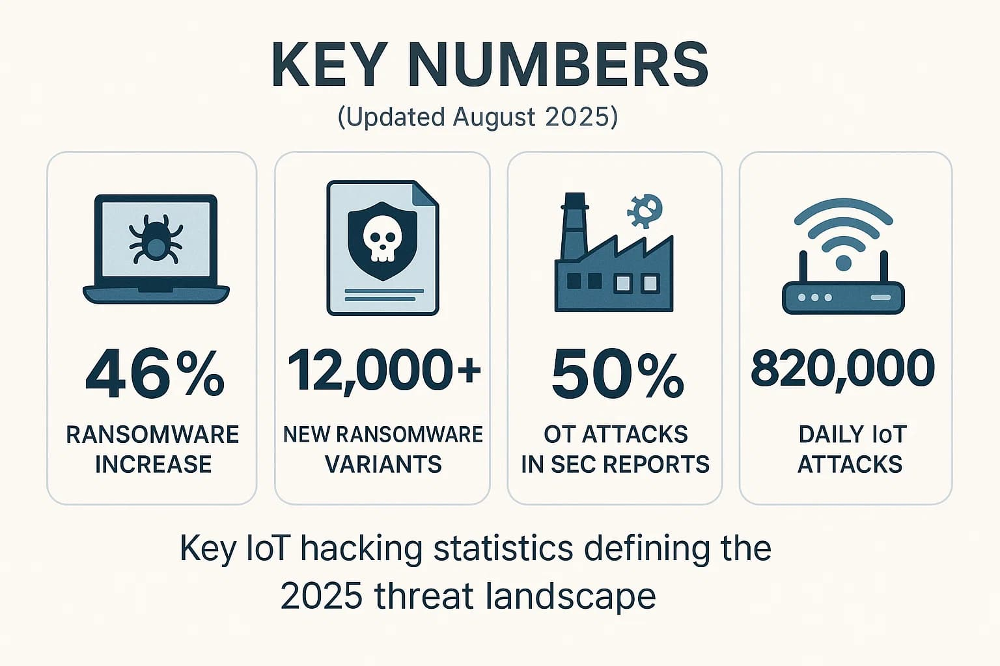
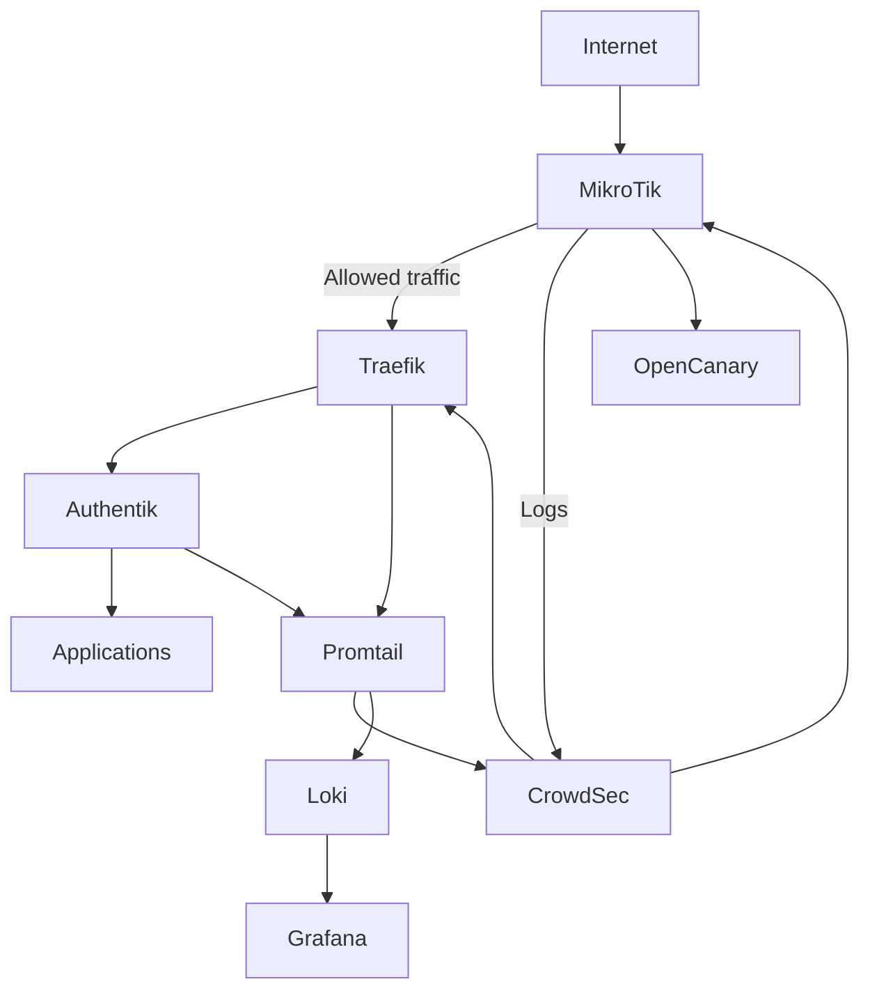
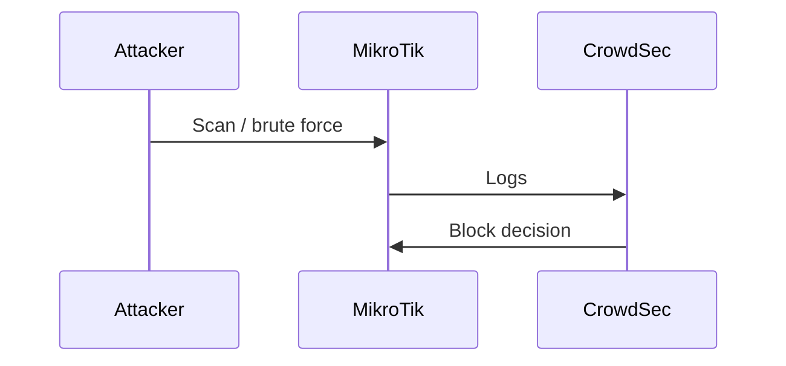
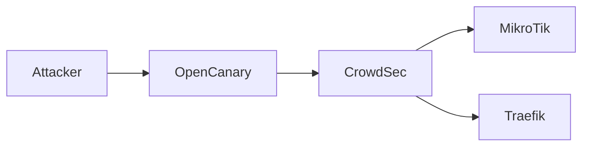

# 🔐 Security-First Homelab Architecture
*A defense-in-depth approach, documented openly*

> **“Security is not a product, but a process.” — Bruce Schneier**

This repository documents **our security architecture**, design decisions, and phased hardening strategy for a self‑hosted, publicly exposed homelab running Kubernetes (k3s).  
It is intentionally opinionated, practical, and grounded in **real-world failures** we’ve seen repeatedly in breached organizations.

This is not about paranoia.  
This is about **engineering discipline**.

---

## ❗ Why Security Is Non‑Negotiable

In the real world, breaches rarely happen because of “advanced hackers”.  
They happen because of:

- Flat networks  
- No log correlation  
- Blind trust in perimeter firewalls  
- No identity awareness  
- Security tooling coupled to production systems  

### Real-world examples:
- **Equifax (2017)** – unpatched public service, no early detection  
- **Uber (2016)** – credentials leaked, no internal detection  
- **LastPass (2022)** – lateral movement after initial access  
- **Colonial Pipeline (2021)** – single compromised account, massive impact  




None of these failures were due to lack of tools.  
They were due to **lack of architecture**.

This project is our answer to that.

---

## 🧠 Core Security Philosophy

We design with the following principles:

- **Defense in depth** (multiple independent layers)
- **Out-of-band security** (security does not depend on the cluster it protects)
- **Behavioral detection > static rules**
- **Identity is the new perimeter**
- **Assume breach, limit blast radius**
- **Observability enables security**

No single tool is trusted.  
Every layer assumes the one below it can fail.

---

## 🧱 Infrastructure Overview

### Hardware Inventory

```text
sentinel (RPi 3B, 1GB)              196.xxx.10.xx   ← dedicated security node
HP Microserver Gen8                 196.xxx.30.xx   ← storage / databases / future Wazuh
Intel NUC (k3s control)             196.xxx.20.xx
Lenovo ThinkCentre (workers)        196.xxx.20.xx
Intel NUC (Proxmox)                 196.xxx.30.xx
```

---

## 🗺️ High-Level Architecture



---

## 🛡️ The Phased Security Approach

We **intentionally phase security**.  
Each phase increases protection, reduces risk, and adds visibility.

This avoids:
- Complexity overload
- False confidence
- Brittle systems

---

## 🥉 Phase 1 — Baseline Hardening (Security Level: 3/10)

**Goal:** Remove obvious weaknesses.

**What we do:**
- Harden OS access
- Enforce SSH key-only access
- Disable unused services
- Apply firewall defaults

**Why:**  
Most attacks succeed at this layer.

---

## 🥈 Phase 2 — Perimeter Awareness (Security Level: 5/10)

**Goal:** Detect and block hostile behavior early.

**What we add:**
- MikroTik firewall logging
- CrowdSec (behavioral engine)
- Fail2ban on all nodes

**Why:**  
Static rules don’t scale. Behavior does.



---

## 🥇 Phase 3 — Identity & Application Defense (Security Level: 7/10)

**Goal:** Protect exposed services properly.

**What we add:**
- Traefik ingress
- Authentik (central identity)
- Promtail log routing
- Loki + Grafana visibility

**Why:**  
Most breaches today are **identity failures**, not exploits.

---

## 🏆 Phase 4 — Deception & Correlation (Security Level: 9/10)

**Goal:** Detect attackers even when nothing looks broken.

**What we add:**
- OpenCanary (honeypots)
- Cross-layer log correlation
- Edge + ingress enforcement

**Why:**  
A honeypot hit is a **100% malicious signal**.



---

## 🧠 Why Security Lives Outside Kubernetes

Security systems must **survive cluster failure**.

That’s why:
- CrowdSec runs on a dedicated node
- Enforcement happens at the router
- Logs are exported outward

This avoids circular dependency — a common enterprise mistake.

---

## 🚫 What We Explicitly Avoid

- No “all-in-one” security boxes
- No inline IPS on weak hardware
- No blind trust in dashboards
- No security tools running *inside* what they protect

Discipline beats complexity.

---

## 📈 Final Outcome

By the final phase, we achieve:

- Early threat detection
- Minimal public attack surface
- Identity-aware enforcement
- Zero-trust assumptions
- Clear audit trail
- Scalable growth path (Wazuh later)

This is **not about being unhackable**.  
It’s about being **hard enough that attackers move on**.

---

## 🔚 Closing Thoughts

Security is not a feature you “add later”.  
It is a **design constraint**.

This repository is our transparent look into how we approach it —  
calmly, deliberately, and without compromise.

> **We do not aim for perfect security.  
> We aim for engineered security.**

---

🛠️ *More diagrams, configs, and implementation details will be added as each phase is executed.*
