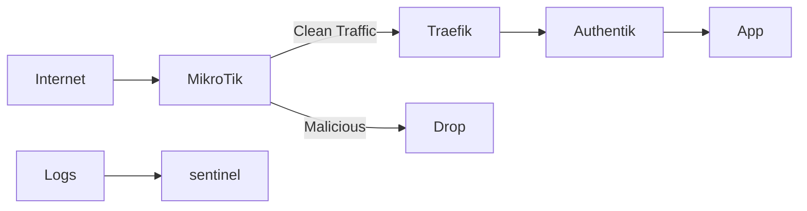

# 5️⃣ What We Do Next — Security Execution Plan

> *Context without execution is just theory.*  
This document marks the transition from **design** to **action**.

We now move from **intentional architecture** to **deliberate implementation**.  
The order below is **non-negotiable** — each step reduces risk before the next is introduced.

---

## Phase 0 — Ground Rules

Before touching Kubernetes:

- No public exposure
- No port forwarding
- No applications
- No shortcuts

We harden, observe, then expose.

---

## 🔒 Phase 1 — Lock Down `sentinel` (Security Node)

**Objective:** Ensure the security control plane cannot be trivially compromised.

### Actions
- Minimal OS install (Raspberry Pi OS Lite)
- Remove unused packages & services
- SSH hardening:
  - Key-only auth
  - Non-root login
- Enable firewall (nftables or ufw):
  - Allow SSH (trusted IPs only)
  - Allow syslog (UDP/TCP 514)
  - Allow CrowdSec API
- Install Fail2Ban (SSH protection)

### Outcome
✔ Security brain is hardened  
✔ Logging destination is trustworthy  

**Security Maturity:** 🟩 Basic Hardening

---

## 📡 Phase 2 — Centralized Logging (Syslog + Promtail)

**Objective:** Ensure visibility exists *before* enforcement.

### Actions
- Configure MikroTik:
  - Send firewall + auth logs to `sentinel`
- Configure syslog listener on `sentinel`
- Install Promtail:
  - Ingest MikroTik logs
  - Prepare for Traefik & app logs
- Validate logs in Grafana/Loki

### Outcome
✔ Router activity is visible  
✔ Attack patterns observable  
✔ No blind spots at the edge  

**Security Maturity:** 🟦 Observability Achieved

---

## 🧠 Phase 3 — CrowdSec (Detection Engine)

**Objective:** Convert raw logs into security decisions.

### Actions
- Install CrowdSec on `sentinel`
- Enable collections:
  - Linux
  - MikroTik
  - HTTP/Generic
- Validate:
  - Scenarios triggering
  - Decisions created
- Tune ban durations (default → staged escalation)

### Outcome
✔ Intelligence-driven blocking  
✔ No static rules  
✔ Community-powered detection  

**Security Maturity:** 🟨 Adaptive Defense

---

## 🎯 Phase 4 — OpenCanary (Deception Layer)

**Objective:** Detect malicious intent *early*.

### Actions
- Deploy OpenCanary on `sentinel`
- Enable:
  - Fake SSH service
  - Fake HTTP admin panels
- Forward OpenCanary alerts:
  - Logs → Promtail → Loki
  - Optional → CrowdSec signals

### Outcome
✔ Early-warning system  
✔ Detects recon & curiosity  
✔ Separates noise from intent  

**Security Maturity:** 🟧 Proactive Detection

---

## 🚦 Phase 5 — MikroTik CrowdSec Bouncer

**Objective:** Stop attacks before they reach Kubernetes.

### Actions
- Deploy CrowdSec MikroTik bouncer
- Authenticate with CrowdSec API
- Enforce:
  - Drop malicious IPs
  - Optional country-based controls
- Verify:
  - Blocks occur at router
  - No ingress traffic from banned IPs

### Outcome
✔ Attacks die at the edge  
✔ Ingress protected by default  
✔ Resource exhaustion prevented  

**Security Maturity:** 🟥 Edge Enforcement

---

## ☸️ Phase 6 — Rebuild k3s (Security-First)

**Objective:** Deploy Kubernetes into a hardened perimeter.

### Actions
- Fresh k3s install:
  - Minimal components
  - No public NodePorts
- Traefik:
  - Access logs enabled
  - Forwarded to Promtail
- Authentik:
  - Enforced SSO
  - MFA required
- Network policies:
  - Default deny
- Secrets:
  - No plaintext env vars

### Outcome
✔ Kubernetes is *not* the first line of defense  
✔ Identity-aware access  
✔ Logs feed detection systems  

**Security Maturity:** 🟪 Defense in Depth

---

## 🧱 Final State — Layered Security Model

---

## 🔜 What Comes After

Once this is complete:
- Public exposure becomes *boring*
- Attacks become *routine*
- Alerts become *actionable*

Security stops being stressful — and starts being **predictable**.